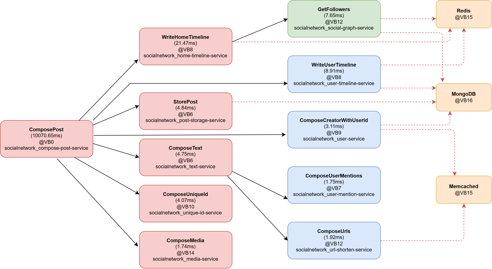

# Distributed eBPF Profiling Framework — 25-Node Deployment

Zero-instrumentation compute flow attribution framework tested on the DeathStarBench Social Network across a 25-VM cluster. eBPF probes silently observe every Thrift RPC call, CPU burst, memory allocation, and network byte on each node without modifying any application binary.

---

## Quick Start

Open **four terminals** and run the steps below in order.

---

### Terminal 1 — Start the Central Log Handler

```bash
python3 src/log_handler.py
```

Leave this running. It listens on port `5000` and receives session uploads from all 25 nodes at the end of a test run.

---

### Terminal 2 — Deploy the Cluster

```bash
git checkout DSB/socialNetwork/nginx-web-server/lua-scripts/ \
             DSB/socialNetwork/nginx-web-server/jaeger-config.json \
             DSB/socialNetwork/config/service-config.json

bash deploy_all_node.sh
```

This takes approximately 5 minutes. The script:
1. Wipes existing container state on all 25 VMs
2. Deploys all services via Docker Compose in host-networking mode across `10.5.30.94–117`
3. Waits for Nginx to come live, then populates the social graph with 18,000 synthetic users
4. Injects a USC daemon on each node via SSH, targeting the active container PIDs and pointing telemetry at your local log handler

Wait for the message: **✅ Distributed Teardown cleanly completed. Exiting entirely.**

---

### Terminal 3 — Generate Load

```bash
bash tests/DSB-tester.sh 10.5.30.93 50
```

Sends 50 concurrent HTTP POST requests to the Nginx ingress. You should see 50 `HTTP 200 — Successfully upload post` responses.

Once all responses arrive, send **Ctrl+C** to Terminal 2. This signals all USC daemons to flush their session data and POST it to the log handler.

---

### Terminal 4 — Extract the Call Graph

```bash
curl http://localhost:5000/graph/print > src/graphs/final_profiling_trace.log
cat src/graphs/final_profiling_trace.log
```

---

## What the Framework Observes

The system reconstructs a complete distributed call graph and per-request resource profile from raw kernel events with no changes to any service binary.

### Zero-Instrumentation Span Identity
Each incoming Thrift frame is decoded in kernel space at the receive syscall boundary. The method name, sequence number, and a hash of the TCP 4-tuple form a human-readable span ID (e.g. `ComposePost_seq0_015d8f33dd4d9f89`). No trace headers are injected into the application protocol.

### Cross-Machine Edge Stitching
When a service sends an outgoing Thrift call, the eBPF program reads the destination 4-tuple from the kernel socket structure and decodes the downstream method name and forwarded request ID from the binary payload. The log handler matches this outgoing event to the ENTRY event on the child node using the 4-tuple as the primary key, producing a provably correct causal edge across machine boundaries.

### CPU Burst Tracking
The scheduler's `sched_switch` tracepoint fires at every context switch. The framework reads hardware PMU cycle and instruction counters at switch-in and switch-out for every monitored thread, accumulating exact on-CPU intervals. This separates active compute time from blocking wait time — a separation impossible to obtain from wall-clock timestamps alone.

### Physical Memory Attribution
Every physical page allocated to a monitored thread is tracked by its Page Frame Number (PFN). The peak simultaneously-resident physical footprint is recorded per span, reflecting actual DRAM usage rather than the virtual address space size.

### Per-Span Resource Record
At thread exit, each span produces a complete resource record: wall-clock latency, active CPU time, CPU burst count, hardware cycles and instructions, peak physical memory, virtual memory footprint, and network bytes sent and received.

### Cluster-Wide Accumulation
The log handler performs a recursive depth-first traversal of the reconstructed call tree, summing every child span's resource figures into the root span. The result is a single cost vector representing the total cluster-wide expenditure for one end-to-end request.

---

## Sample Output

### Distributed Call Graph (DAG)

```
Machines reported: 25  |  Total requests: 550  |  Total edges: 515  |  Unmatched: 440

└── ComposePost_seq0_015d8f33dd4d9f89  [10.5.30.95:9090] (10114.62ms) @VB2 | compose-post-service-1(263562)
    ├── WriteUserTimeline_seq0_057e2ace344164cc  [10.5.30.105:9090] (76.02ms)  @VB12 | user-timeline-service-1(1694416)
    │   ├── ⛁ [MongoDB] 10.5.30.111:27017 (3 calls)
    │   └── ⛁ [Redis]   10.5.30.93:6379
    ├── WriteHomeTimeline_seq0_21a43659d7049c82  [10.5.30.96:9090]  (4.01ms)   @VB3  | home-timeline-service-1(265166)
    │   ├── GetFollowers_seq0_d6020e42056d2db5   [10.5.30.99:9090]  (1.70ms)   @VB6  | social-graph-service-1(1374388)
    │   │   └── ⛁ [Redis] 10.5.30.117:6379 (3 calls)
    │   └── ⛁ [Redis] 10.5.30.116:6379
    ├── ComposeText_seq0_3d0e3ddd502d976c         [10.5.30.100:9090] (17.86ms)  @VB7  | text-service-1(322241)
    │   ├── ComposeUserMentions_seq0_039777...    [10.5.30.103:9090] (0.30ms)   @VB10 | user-mention-service-1(360186)
    │   └── ComposeUrls_seq0_54145641447226bc     [10.5.30.102:9090] (0.18ms)   @VB9  | url-shorten-service-1(391422)
    ├── ComposeCreatorWithUserId_seq0_6457...     [10.5.30.104:9090] (0.11ms)   @VB11 | user-service-1(469139)
    ├── ComposeMedia_seq0_a834c8084d8f23f8        [10.5.30.97:9090]  (0.47ms)   @VB4  | media-service-1(282298)
    ├── ComposeUniqueId_seq0_c938dacf9b9d3c4e     [10.5.30.101:9090] (0.25ms)   @VB8  | unique-id-service-1(2729297)
    └── StorePost_seq0_7acd4fa9009a078a           [10.5.30.98:9090]  (1.33ms)   @VB5  | post-storage-service-1(297581)
        └── ⛁ [MongoDB] 10.5.30.107:27017
```

The root span (`ComposePost`) shows ~10,100 ms wall-clock time — a Thrift connection timeout. Despite this, every child span that did reply is captured in full. `WriteUserTimeline` at 76 ms with three sequential MongoDB calls is the single slowest completing child. The five stateless services (`ComposeMedia`, `ComposeUniqueId`, `ComposeCreatorWithUserId`, `ComposeUserMentions`, `ComposeUrls`) all complete in under 0.5 ms. The 440 unmatched connections are database leaf nodes where no USC daemon runs — correctly expected, not missing edges.

---
## Reconstructed Distributed Call Graph
```
FlowLens reconstructs distributed execution paths as Directed Acyclic Graphs (DAGs) by correlating kernel events, RPC interactions, and network-level identifiers across multiple hosts. The figure below illustrates the execution flow of a `ComposePost` request, including service fan-out, backend database interactions, and cross-machine causal dependencies.
```

<p align="center">
  
</p>

### Accumulated Resource Summary (Cluster-Wide Totals per Root Request)

Each row is the recursive sum of every child span's resource figures collapsed into the root request — the total cluster-wide cost of one `ComposePost` call spanning all nine participating machines.

```
Request-ID                         | Machine | Latency(ms) | CPU(ms) | Bursts | Cycles     | VirtMem(KB) | PeakPhy(KB) | Send(KB) | Recv(KB) | DiskRd(KB) | DiskWr(KB)
-----------------------------------|---------|-------------|---------|--------|------------|-------------|-------------|----------|----------|------------|----------
ComposePost_seq0_015d8f33dd4d9f89  | VB2     |  10114.620  |  15.451 |     58 | 15,451,001 |    50,232.0 |       808.0 |      8.5 |      3.9 |        0.0 |        0.0
ComposePost_seq0_0d3c9439b6e1fd4b  | VB2     |  10160.775  |  15.711 |     78 | 15,709,865 |    25,776.0 |       592.0 |      6.2 |      3.1 |        0.0 |        0.0
ComposePost_seq0_16f46d290782d0dc  | VB2     |  10141.104  |  13.119 |     64 | 13,114,889 |    25,644.0 |       708.0 |      5.3 |      3.1 |        0.0 |        0.0
ComposePost_seq0_23a2060bdc17bbc2  | VB2     |  10159.387  |  19.533 |     73 | 19,538,387 |    51,288.0 |       644.0 |      5.4 |      2.9 |        0.0 |        0.0
ComposePost_seq0_8516e067d45f02d5  | VB2     |  10102.179  |  14.088 |    141 | 14,085,917 |    49,968.0 |       644.0 |      5.3 |      2.6 |        0.0 |        0.0
```

**What each column reveals:**

- **Latency** — Wall-clock time from first byte received to thread exit on the root service, including all downstream blocking. All requests sit near the ~10,100 ms Thrift connection timeout, confirming the root service was blocked waiting on a downstream reply that never returned within the deadline.

- **CPU / Bursts / Cycles** — Across all 9 machines, each request consumed only **9–20 ms** of real CPU time despite ~10,100 ms of elapsed time. Over **99.8% of end-to-end time was spent waiting**, not computing. Burst count variation at similar CPU levels (e.g. 58 vs 141 bursts for near-identical CPU) reflects scheduler contention differences between request windows, not algorithmic cost differences.

- **Virtual Memory** — The mmap footprint of all threads involved, ranging from ~9 MB to ~58 MB per request. Multiplied by the 50-request concurrency level, this gives a direct lower bound on the memory capacity the cluster must sustain under load.

- **Peak Physical** — The maximum simultaneously-resident physical DRAM across the span lifetime, measured at page-frame-number granularity. Consistently in the **572–892 KB** range — the true hardware footprint, orders of magnitude smaller than the virtual address space.

- **Network Send / Recv** — Total bytes transmitted across all service-to-service Thrift calls for the request. Small values (3–22 KB sent, 1–7 KB received) confirm the workload is latency-bound, not bandwidth-bound.

- **Disk Read / Write** — Zero throughout, confirming all persistence goes through in-memory Redis and MongoDB with no direct file I/O on the monitored Thrift service threads.
